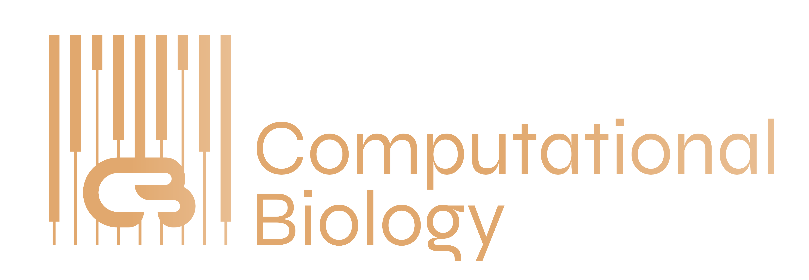
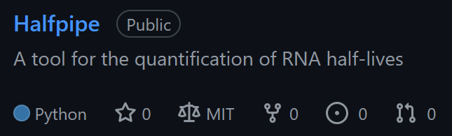
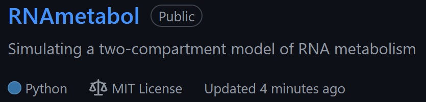

  <h1 align="center"><b>Hello World, I am Jason! 💻</h1>

  I am a Computational Biologist at the Institute of Medical Statistics and Computational Biology at the University of Cologne. I love modeling complex systems to drive scientific discovery! Currently, I am a member of the CompBio work group:

 

  

 

<h2 align="center">My Research and Projects</h2>

  My research focuses on the quantification of the RNA life cycle. In this context, I am the main developer of the software tool 'Halfpipe', which quantifies RNA half-lives.

 

  

 

  In addition, I have developed a simulation framework called RNAmetabol that can be used for experimental design of RNA metabolism experiments with 4sU labeling.

 

  

 

